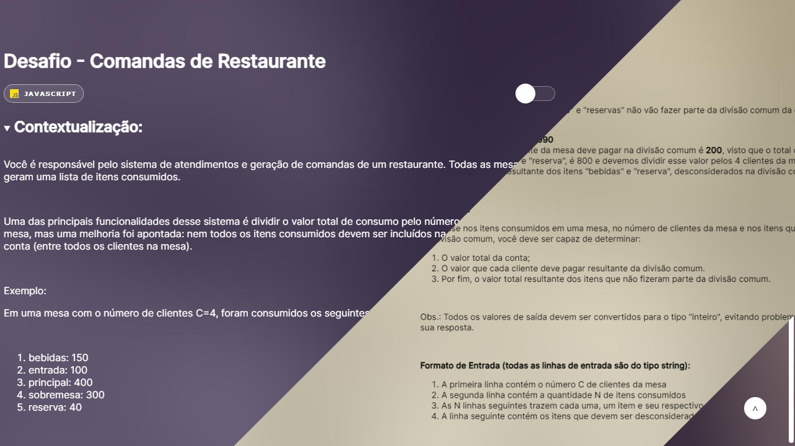

# Challenge - Restaurant Tickets

This is a JavaScript solution to the tickets challenge. You can see the site with the result and read about the challenge below.

## Table of contents

-   [Overview](#overview)
    -   [Screenshot](#screenshot)
    -   [Link](#link)
-   [The Challenge](#the-challenge)
    -   [Description](#description)
    -   [Example](#example)
-   [Author](#author)

## Overview

### Screenshot

### Link

-   [Live Site URL](https://bernardovazm.github.io/desafio-comandas-restaurante/)

## The Challenge

### Description

Tickets in a Restaurant

<strong>Context:</strong>

You are responsible for the customer service system and generation of
you run a restaurant. All tables generate a list
of items consumed.

 

One of the main features of this system is to divide the
total consumption value by the number of customers at the table, but
an improvement was pointed out: not all items consumed
must be included in the common division of the account (among all
customers at the table).

 

Example:

At a table with the number of customers C=4,
the following items with their respective values:

 

<ol>
<li>drinks: 150</li>
<li>entry: 100</li>
<li>main: 400</li>
<li>dessert: 300</li>
<li>reserved: 40</li>
</ol>

 

It was identified that the items "drinks" and "reserveds" will not
be part of the common division of the account. We can conclude
so that:

<ol>
<li>The total amount of the bill is <strong>990</strong></li>
<li>
The amount that each customer at the table must pay in the split
common is <strong>200</strong>, since the total number of
items, with the exception of the "drinks" and "reserved" items, is
800 and we must divide this amount among the 4 customers of the
table.
</li>
<li>
Finally, the value resulting from the items "drinks" and
"reserve", disregarded in the common division is
<strong>190</strong>.
</li>
</ol>

 

<strong>Your challenge:</strong>

Based on the items consumed at a table, the number of
customers from the table and the items that must be removed from the
common division, you should be able to determine:

<ol>
<li>The total amount of the bill;</li>
<li>
The amount that each customer must pay resulting from the
common division.
</li>
<li>
Finally, the total value resulting from the items that did not
were part of the common division.
</li>
</ol>

 

Note: All output values must be converted to
"integer" type, avoiding formatting problems of your
response.

 

<strong
>Input Format (all input lines are from
string type):</strong
>

<ol>
<li>
The first line contains the number C of customers at the table
</li>
<li>
The second line contains the number N of items
consumed
</li>
<li>
The following N lines each contain an item and its
respective value separated by space.
</li>
<li>
The next line contains the items that must be
disregarded in the common division, separated by space
</li>
</ol>

 

<strong
>Output Format (all output lines must be
converted to type "integer"):</strong
>

<ol>
<li>The first line must contain the total amount of the bill</li>
<li>
The second line must contain the value that each customer
need to pay as a result of common division.
</li>
<li>
The third line must contain the resulting total value
of items that were not part of the common division
</li>
</ol>

 

### Example

<strong>Example input:</strong>

<pre class="ql-syntax" spellcheck="false">
4
5
drinks 150
entry 100
main 400
dessert 300
reserve 40
reserve drinks
</pre>

 

<strong>Example output:</strong>

<pre class="ql-syntax" spellcheck="false">
990
200
190
</pre>

## Built with

-   Semantic HTML5 markup
-   CSS custom properties
-   Functional programming with JavaScript

## Author

-   Github - [bernardovazm](https://github.com/bernardovazm)
-   Frontend Mentor - [@bernardovazm](https://www.frontendmentor.io/profile/bernardovazm)
-   LinkedIn - [Bernardo Vaz](https://www.linkedin.com/in/bernardovazm/)
